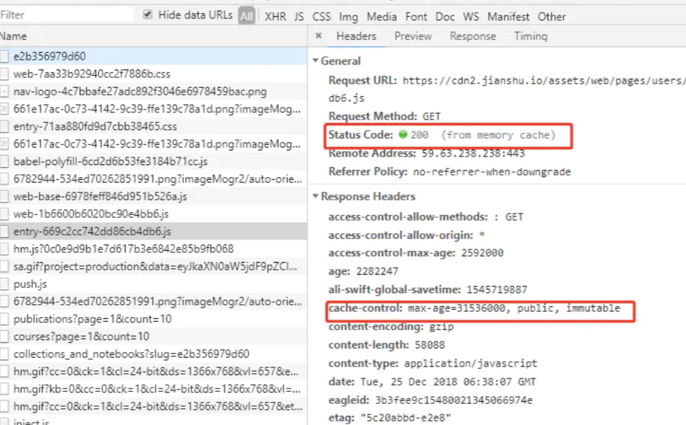

#### 常见的网路知识点

#### HTTP1, HTTP2, HTTPS

##### http1.1：

- **改进点：**

1. **持久连接**
   - 引入了持久连接，即TCP连接默认不关闭，可以被多个请求复用，不用声明`Connection: keep-alive`(对于同一个域名，大多数浏览器允许同时建立6个持久连接)
2. **管道机制**
   - 即在同一个TCP连接里面，客户端可以同时发送多个请求。
3. **分块传输编码**
   - 即服务端没产生一块数据，就发送一块，采用”流模式”而取代”缓存模式”。
4. **新增请求方式**
   - PUT:请求服务器存储一个资源;
   - DELETE：请求服务器删除标识的资源；
   - OPTIONS：请求查询服务器的性能，或者查询与资源相关的选项和需求；
   - TRACE：请求服务器回送收到的请求信息，主要用于测试或诊断；
   - CONNECT：保留将来使用

- **缺点：**
  - 虽然允许复用TCP连接，但是同一个TCP连接里面，所有的数据通信是**按次序进行**的。服务器只有处理完一个请求，才会接着处理下一个请求。如果前面的处理特别慢，后面就会有许多请求排队等着。这将导致“队头堵塞”
  - **避免方式：**一是减少请求数，二是同时多开持久连接

##### HTTP/2.0

- ### 特点：

  1. 采用二进制格式而非文本格式；
  2. 完全多路复用，而非有序并阻塞的、只需一个连接即可实现并行；
  3. 使用报头压缩，降低开销
  4. 服务器推送

**1. 二进制协议**

- HTTP/1.1 版的头信息肯定是文本（ASCII编码），数据体可以是文本，也可以是二进制。HTTP/2 则是一个彻底的二进制协议，头信息和数据体都是二进制，并且统称为”帧”：头信息帧和数据帧。
- 二进制协议解析起来更高效、“线上”更紧凑，更重要的是错误更少。

**2. 完全多路复用**

- HTTP/2 复用TCP连接，在一个连接里，客户端和浏览器都可以同时发送多个请求或回应，而且不用按照顺序一一对应，这样就避免了”队头堵塞”。

**3. 报头压缩**

- HTTP 协议是没有状态，导致每次请求都必须附上所有信息。所以，请求的很多头字段都是重复的，比如Cookie，一样的内容每次请求都必须附带，这会浪费很多带宽，也影响速度。
- 对于相同的头部，不必再通过请求发送，只需发送一次；
- HTTP/2 对这一点做了优化，引入了头信息压缩机制；
- 一方面，头信息使用gzip或compress压缩后再发送；
- 另一方面，客户端和服务器同时维护一张头信息表，所有字段都会存入这个表，产生一个索引号，之后就不发送同样字段了，只需发送索引号。

**4. 服务器推送**

- HTTP/2 允许服务器未经请求，主动向客户端发送资源；
- 通过推送那些服务器任务客户端将会需要的内容到客户端的缓存中，避免往返的延迟

##### HTTPS

- HTTP协议通常承载于TCP协议之上，在HTTP和TCP之间添加一个安全协议层（SSL或TSL），这个时候，就成了我们常说的HTTPS.

##### 1、HTTPS主要作用

```
- （1）对数据进行加密，并建立一个信息安全通道，来保证传输过程中的数据安全;
- （2）对网站服务器进行真实身份认证。
```

##### 2、HTTPS和HTTP的区别

```
- 1、HTTPS是加密传输协议，HTTP是名文传输协议;
- 2、HTTPS需要用到SSL证书，而HTTP不用;
- 3、HTTPS比HTTP更加安全，对搜索引擎更友好，利于SEO,
- 4、 HTTPS标准端口443，HTTP标准端口80;
- 5、 HTTPS基于传输层，HTTP基于应用层;
```

##### 3、HTTPS和HTTP的工作过程区别

- **HTTP 包含动作：**
  1. 浏览器打开一个 TCP 连接
  2. 浏览器发送 HTTP 请求到服务器端
  3. 服务器发送 HTTP 回应信息到浏览器
  4. TCP 连接关闭
- **SSL 包含动作：**
  1. 验证服务器端
  2. 客户端和服务器端选择加密算法和密码，确保双方都支持
  3. 验证客户端(可选)
  4. 使用公钥加密技术来生成共享加密数据
  5. 创建一个加密的 SSL 连接
  6. 基于该 SSL 连接传递 HTTP 请求

##### 3、HTTPS加密方式

- **对称加密**：加密和解密都是使用的同一个密钥；

- **非对称加密：**

  - 加密使用的密钥和解密使用的密钥是不相同的，分别称为：公钥、私钥；
  - 公钥和算法都是公开的，私钥是保密的。
  - **非对称加密过程：**

  1. 服务端生成配对的公钥和私钥
  2. 私钥保存在服务端，公钥发送给客户端
  3. 客户端使用公钥加密明文传输给服务端
  4. 服务端使用私钥解密密文得到明文

- **数字签名**：签名就是在信息的后面再加上一段内容，可以证明信息没有被修改过。

#### 浏览从输入网址到回车发生了什么

1.从浏览器接收url到开启网络请求线程---> 浏览器是多线程的(js线程是其中一个)---->这也是为什么常说JS引擎是单线程的输入URL后，会进行解析 ---->需要进行dns解析成IP ----> 然后就开始建立连接 ------> 三次握手开始了-----> 

```
第一次,客户端=>服务器端,,只能判断出客户端具备发送能力,

第二次,服务器端=>客户端,此时就可以判断出服务器端具备接受能力和发送能力,但是此时不能确认客户端是否具备接受能力,因此还需要第三次

第三次,客户端=>服务器端,此时确保了客户端的接受能力是没有问题的,因此,经过三次握手之后, 正式建立连接
```

然后开始传输数据了 -----> 

#### 前端跨域

jsonp

Script标签

nginx 转发

后台配置允许跨域


#### 浏览器缓存

在工作中，前端代码打包之后的生成的静态资源就要发布到静态服务器上，这时候就要做对这些静态资源做一些运维配置，其中，gzip和设置缓存是必不可少的。这两项是最直接影响到网站性能和用户体验的。

缓存的优点：

- 减少了不必要的数据传输，节省带宽
- 减少服务器的负担，提升网站性能
- 加快了客户端加载网页的速度
- 用户体验友好

##### 什么是强缓存？

当浏览器去请求某个文件的时候，服务端就在respone header里面对该文件做了缓存配置。缓存的时间、缓存类型都由服务端控制，具体表现为：
 respone header 的cache-control，常见的设置是max-age public private no-cache no-store等

如下图,
设置了**cahe-control:max-age=315360000,public,immutable**



max-age表示缓存的时间是315360000秒（10年），

public表示可以被浏览器和代理服务器缓存，代理服务器一般可用nginx来做。immutable表示该资源永远不变，但是实际上该资源并不是永远不变，它这么设置的意思是为了让用户在刷新页面的时候不要去请求服务器！啥意思？就是说，

如果你只设置了cahe-control:max-age=315360000,public  这属于强缓存，每次用户正常打开这个页面，浏览器会判断缓存是否过期，没有过期就从缓存中读取数据；


如果cahe-control:max-age=315360000,public再加个immutable的话，就算用户刷新页面，浏览器也不会发起请求去服务，浏览器会直接从本地磁盘或者内存中读取缓存并返回200状态，看上图的红色框（from memory cache）。这是2015年facebook团队向制定 HTTP 标准的 IETF 工作组提到的建议：他们希望 HTTP 协议能给 Cache-Control 响应头增加一个属性字段表明该资源永不过期，浏览器就没必要再为这些资源发送条件请求了。

##### 强缓存总结

1. cache-control: max-age=xxxx，public
    客户端和代理服务器都可以缓存该资源；
    客户端在xxx秒的有效期内，如果有请求该资源的需求的话就直接读取缓存,statu code:200 ，如果用户做了刷新操作，就向服务器发起http请求
2. cache-control: max-age=xxxx，private
    只让客户端可以缓存该资源；代理服务器不缓存
    客户端在xxx秒内直接读取缓存,statu code:200
3. cache-control: max-age=xxxx，immutable
    客户端在xxx秒的有效期内，如果有请求该资源的需求的话就直接读取缓存,statu code:200 ，即使用户做了刷新操作，也不向服务器发起http请求
4. cache-control: no-cache
    跳过设置强缓存，但是不妨碍设置协商缓存；一般如果你做了强缓存，只有在强缓存失效了才走协商缓存的，设置了no-cache就不会走强缓存了，每次请求都回询问服务端。
5. cache-control: no-store
    不缓存，这个会让客户端、服务器都不缓存，也就没有所谓的强缓存、协商缓存了。

什么是协商缓存？

协商缓存就是需要客户端和服务器两端进行交互的

**怎么设置协商缓存？**

response header里面的设置

```bash
etag: '5c20abbd-e2e8'
last-modified: Mon, 24 Dec 2018 09:49:49 GMT
```

etag：每个文件有一个，改动文件了就变了，就是个文件hash，每个文件唯一，就像用webpack打包的时候，每个资源都会有这个东西，如： app.js打包后变为 app.c20abbde.js，加个唯一hash，也是为了解决缓存问题。

last-modified：文件的修改时间，精确到秒


每次请求返回来 response header 中的 etag和 last-modified，在下次请求时在 request header 就把这两个带上，服务端把你带过来的标识进行对比，然后判断资源是否更改了，如果更改就直接返回新的资源，和更新对应的response header的标识etag、last-modified。如果资源没有变，那就不变etag、last-modified，这时候对客户端来说，每次请求都是要进行协商缓存了，即：


发请求-->看资源是否过期-->过期-->请求服务器-->服务器对比资源是否真的过期-->没过期-->返回304状态码-->客户端用缓存的老资源。

协商缓存步骤总结：

请求资源时，把用户本地该资源的 etag 同时带到服务端，服务端和最新资源做对比。
 如果资源没更改，返回304，浏览器读取本地缓存。
 如果资源有更改，返回200，返回最新的资源。

补充一点，response header中的etag、last-modified在客户端重新向服务端发起请求时，会在request header中换个key名：


```csharp
// response header
etag: '5c20abbd-e2e8'
last-modified: Mon, 24 Dec 2018 09:49:49 GMT

// request header 变为
if-none-matched: '5c20abbd-e2e8'
if-modified-since: Mon, 24 Dec 2018 09:49:49 GMT
```


**为什么要有etag？**
 你可能会觉得使用last-modified已经足以让浏览器知道本地的缓存副本是否足够新，为什么还需要etag呢？HTTP1.1中etag的出现（也就是说，etag是新增的，为了解决之前只有If-Modified的缺点）主要是为了解决几个last-modified比较难解决的问题：

1. **一些文件也许会周期性的更改**，但是他的内容并不改变(仅仅改变的修改时间)，这个时候我们并不希望客户端认为这个文件被修改了，而重新get；
2. **某些文件修改非常频繁**，比如在秒以下的时间内进行修改，(比方说1s内修改了N次)，if-modified-since能检查到的粒度是秒级的，这种修改无法判断(或者说UNIX记录MTIME只能精确到秒)；

3. **某些服务器不能精确的得到文件的最后修改时间**。

##### 怎么设置强缓存与协商缓存

1. 后端服务器如nodejs:
    res.setHeader('max-age': '3600 public')
    res.setHeader(etag: '5c20abbd-e2e8')
    res.setHeader('last-modified': Mon, 24 Dec 2018 09:49:49 GMT)

2. nginx配置


PWA缓存

1. memory cache 和disk cache触发条件
    一个请求在查找资源的过程中经过的缓存顺序是Memory Cache、Service Worker、HTTP Cache、Push “Cache”
   满足使用缓存条件->memory cache→service worker->disk cache
   service worker发送请求也遵从浏览器缓存策略，即如果一个文件中了缓存条件，service worker请求这个文件是从缓存中拿而不是请求服务器，浏览器对service worker的请求会跟其他的请求一样进行处理
   memory cache是会话级别缓存，关闭线程数据消失
    disk cache可以当作永久存储，下次再打开还在
   打开浏览器会从disk cache拿，刷新操作会有一些比较小的文件从memory cache拿
   隐私模式下是从memory cache拿缓存
   https://www.zhihu.com/question/64201378

2. 缓存算法
   最近最少使用策略
   https://www.chromium.org/developers/design-documents/network-stack/disk-cache
   https://www.chromium.org/developers/design-documents/network-stack/disk-cache/disk-cache-v3
   https://zhuanlan.zhihu.com/p/28113197

3. disk cache的储存最大值，超过最大值怎么处理
   使用缓存驱逐 disk cache跟使用的磁盘有关系
   https://stackoverflow.com/questions/44596937/chrome-memory-cache-vs-disk-cache
   https://superuser.com/questions/378991/what-is-chrome-default-cache-size-limit
   https://superuser.com/questions/1316540/where-has-chrome-cache-been-moved-to

4. disk cache 与 sw
   https://dev.to/dnesteryuk/chrome-cache-storage-vs-disk-cache-2f95

5. 查看并发数
   http://www.browserscope.org/?category=network&v=top

6. http缓存和sw缓存会不会造成双份缓存

7. 为什么有的时候没有设置缓存还是会出现缓存的？
   当 response 中没有 Cache-Control:max-age 和 Expires 的时候，缓存可以计算出一个试探性最大使用期。常用算法 LM—Factor 算法。
   [http://www.baitouwei.com/2016/04/20/App-%E7%BC%93%E5%AD%98%E6%96%B9%E6%A1%88%EF%BC%9AHttp-%E7%BC%93%E5%AD%98/](http://www.baitouwei.com/2016/04/20/App-缓存方案：Http-缓存/)

#### cookie,

**cookie:** cookie生命期为只在设置的cookie过期时间之前一直有效，即使窗口或浏览器关闭。 存放数据大小为4K左右, 有个数限制（各浏览器不同），一般不能超过20个。缺点是**不能储存大数据且不易读取**


#### session

 Session是另一种记录客户状态的机制，不同的是Cookie保存在客户端浏览器中，而Session保存在**服务器上**。

4、单个cookie保存的数据不能超过4K，很多浏览器都限制一个站点最多保存20个cookie。

5、可以考虑将登陆信息等重要信息存放为session，其他信息如果需要保留，可以放在cookie中。

####  token

使用Token的目的：Token的目的是为了减轻服务器的压力，减少频繁的查询数据库，使服务器更加健壮。

如何使用Token

1、用设备号/设备mac地址作为Token（推荐）

客户端：客户端在登录的时候获取设备的设备号/mac地址，并将其作为参数传递到服务端。

  服务端：服务端接收到该参数后，便用一个变量来接收同时将其作为Token保存在数据库，并将该Token设置到session中，客户端每次请求的时候都要统一拦截，并将客户端传递的token和服务器端session中的token进行对比，如果相同则放行，不同则拒绝。

此刻客户端和服务器端就统一了一个唯一的标识Token，而且保证了每一个设备拥有了一个唯一的会话。该方法的缺点是客户端需要带设备号/mac地址作为参数传递，而且服务器端还需要保存；优点是客户端不需重新登录，只要登录一次以后一直可以使用，至于超时的问题是有服务器这边来处理，如何处理？若服务器的Token超时后，服务器只需将客户端传递的Token向数据库中查询，同时并赋值给变量Token，如此，Token的超时又重新计时。

2、用session值作为Token

  客户端：客户端只需携带用户名和密码登陆即可。

  客户端：客户端接收到用户名和密码后并判断，如果正确了就将本地获取sessionID作为Token返回给客户端，客户端以后只需带上请求数据即可。

分析：这种方式使用的好处是方便，不用存储数据，但是缺点就是当session过期后，客户端必须重新登录才能进行访问数据。

####  localstorage,

**1. localStorage:** localStorage 的生命周期是永久的，关闭页面或浏览器之后 localStorage 中的数据也不会消失。localStorage **除非主动删除数据，否则数据永远不会消失**


#### sessionstorage

**2. sessionStorage:** sessionStorage 的生命周期是仅在当前会话下有效。sessionStorage 引入了一个“浏览器窗口”的概念，sessionStorage 是在同源的窗口中始终存在的数据。只要这个浏览器窗口没有关闭，即使刷新页面或者进入同源另一个页面，数据依然存在。但是 sessionStorage **在关闭了浏览器窗口后就会被销毁**。同时独立的打开同一个窗口同一个页面，sessionStorage 也是不一样的


#### 状态码


#### TCP连接(三次握手, 四次挥手)

```
第一次握手：建立连接时，客户端发送syn包(syn=j)到服务器，并进入SYN_SEND状态，等待服务器确认；
SYN： 同步序列编号(Synchronize Sequence Numbers) 
第二次握手：服务器收到syn包，必须确认客户的SYN（ack=j+1），同时自己也发送一
个SYN包（syn=k），即SYN+ACK包，此时服务器进入SYN_RECV状态；
第三次握手：客户端收到服务器的SYN＋ACK包，向服务器发送确认包ACK(ack=k+1)，此包发送完毕，客户端和服务器进入ESTABLISHED状态，完成三次握手。
```

四次挥手

```
断开前后连接的过程
1,浏览器通知服务器要断开连接
2,服务器告知浏览器收到断开通知,准备停止业务js
3,服务器程序停止,告知浏览器服务停止
4,浏览器接收到3的响应,确认断开连接
```


项目开发流程、技术架构、说说做的比较好的项目、你在项目中担任的角色、项目中的收获、项目两点、项目中遇到的难点、简历中罗列的技术栈你是怎么理解的，如果让你运用实现你怎么做、组件设计和实现、兼容性问题、底层原理、性能优化、工程化、前端学习规划、算法